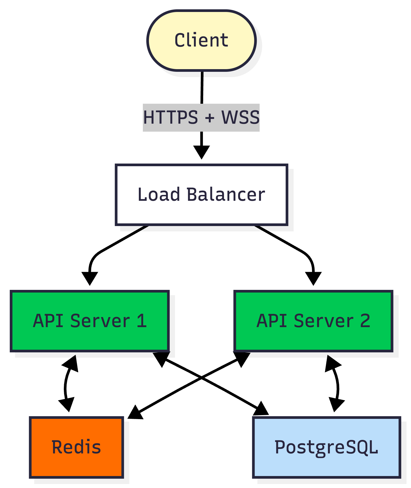
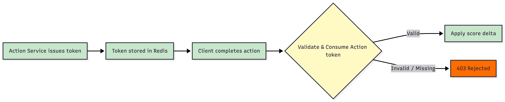
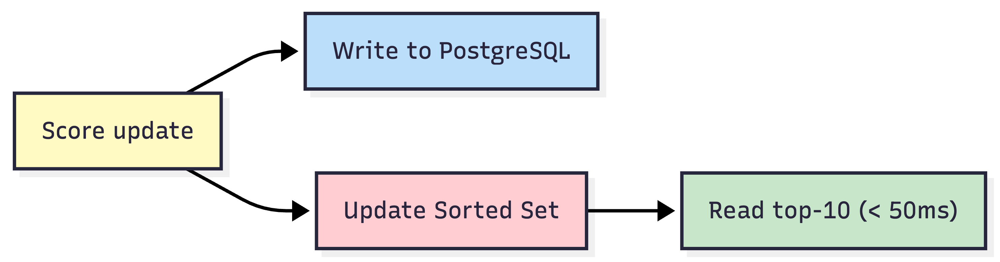
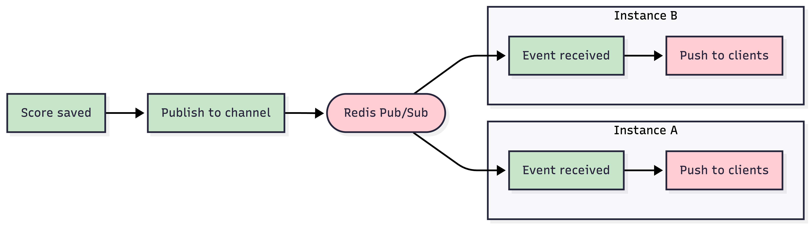
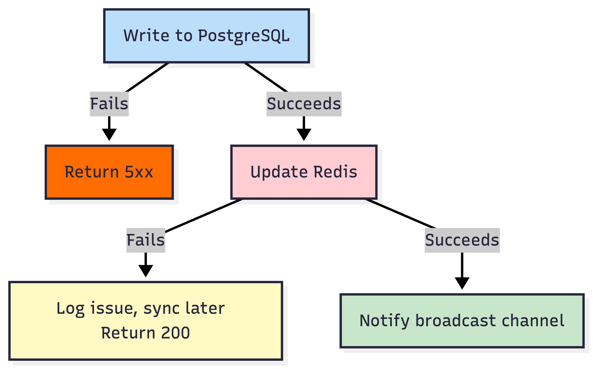
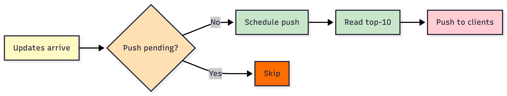

# Architecture – Live Scoreboard Module

> High-level system design, engineering concerns, and key technical decisions.

---

## Table of Contents

1. **[System Overview](#1-system-overview)**
   - [1.1 High-Level Diagram](#11-high-level-diagram)
   - [1.2 Infrastructure Topology](#12-infrastructure-topology)
   - [1.3 Component Responsibilities](#13-component-responsibilities)
2. **[Design Decisions](#2-design-decisions)**
   - [2.1 Security - Preventing Unauthorised Score Updates](#21-security---preventing-unauthorised-score-updates)
   - [2.2 Cache Strategy - Redis Sorted Set](#22-cache-strategy---redis-sorted-set)
   - [2.3 User Metadata - Storage Strategy](#23-user-metadata---storage-strategy)
   - [2.4 Real-time Transport - WebSocket](#24-real-time-transport---websocket)
   - [2.5 Multi-Instance - Cross-Server Broadcast](#25-multi-instance---cross-server-broadcast)
   - [2.6 Score Consistency - Data Sync](#26-score-consistency---data-sync)
   - [2.7 Broadcast Throttling - Avoiding Stampede](#27-broadcast-throttling---avoiding-stampede)
   - [2.8 Operational Concerns](#28-operational-concerns)
3. **[Full score update flow](#3-full-score-update-flow)**

---

## 1. System Overview

### 1.1 High-Level Diagram

<table><tr><td bgcolor="white">

</td></tr></table>

### 1.2 Infrastructure Topology

| Layer | Setup |
|-------|-------|
| **API Servers** | Multiple instances; load balancer with sticky sessions for WebSocket |
| **Redis** | Redis Cluster — high availability, automatic failover |
| **PostgreSQL** | Primary + read replica|

---

### 1.3 Component Responsibilities

| Component | Role |
|-----------|------|
| **Load Balancer** | Spreads traffic across servers. Keeps each WebSocket client on the same server so its connection is not interrupted. |
| [**Score Controller**](#21-security---preventing-unauthorised-score-updates) | Handles score updates: checks user identity, validates the action token, and broadcasts events. |
| [**WebSocket Handler**](#24-real-time-transport---websocket) | Keeps a live connection open for each client. Pushes the updated leaderboard in real time. |
| [**Redis - Sorted Set**](#22-cache-strategy---redis-sorted-set) | Holds the leaderboard in memory so reads are instant. Users are automatically ranked. |
| [**Redis - User Metadata**](#23-user-metadata---storage-strategy) | Caches display names and avatars to keep the leaderboard response fast and enriched. |
| [**Redis - Pub/Sub**](#25-multi-instance---cross-server-broadcast) | Tells all servers when a score changes, so they know to push an update to their own clients. |
| [**Redis - Token Store**](#21-security---preventing-unauthorised-score-updates) | Holds one-time action tokens. A token is deleted immediately after use. |
| [**Redis - Rate Limiter**](#28-operational-concerns) | Counts user requests. Blocks users who try to submit too many updates in a short window. |
| [**PostgreSQL**](#26-score-consistency---data-sync) | The permanent system of record. Stores scores and audit logs for durability and recovery. |

---

## 2. Design Decisions

### 2.1 Security - Preventing Unauthorised Score Updates

JWT alone proves who you are — not that you actually did anything. Without extra enforcement, a user could call the score endpoint over and over with a valid JWT to boost their score.

The fix is two-layer validation: JWT + single-use action token. The token is issued by the **Action Service** when a user starts an action. It is bound to that user and action type, then stored in Redis with a short TTL. This module never issues tokens — it only checks and consumes them.

- The client submits both the JWT and the token when the action finishes.
- The token is consumed in one atomic step. If it is missing, expired, or belongs to a different user, the request is rejected with `403`.
- The server always decides the score delta from `actionType`. The client never submits an amount.

<table><tr><td bgcolor="white">

</td></tr></table>

---

### 2.2 Cache Strategy - Redis Sorted Set

We use a Redis Sorted Set to keep the leaderboard live and fast. Every score update is written to Redis immediately, so the ranking is always up to date and reads take less than 50ms.

- Writes update user positions in-place — fast at any scale.
- Top-K reads return members in ranked order directly from the data structure.
- Leaderboard reads never read directly from the Database.

<table><tr><td bgcolor="white">

</td></tr></table>

---

### 2.3 User Metadata - Storage Strategy

The leaderboard response needs `displayName` and `avatarUrl` next to each score. The simplest approach looks like embedding this data directly in the sorted set member — but that breaks score updates: changing any profile field (name, avatar) would require deleting and re-adding the member, which is not atomic and can go wrong under concurrent writes. Looking up a user by ID in such a structure would also require scanning the whole set.

Instead, `userId` is the sorted set member. User metadata lives in a separate hash per user: `scoreboard:user:{userId}`. After reading the top-10 user IDs, their metadata is fetched in one batched request — a single round-trip. Score operations stay simple; profile updates only touch the hash.

---

### 2.4 Real-time Transport - WebSocket

The leaderboard must push ranking updates to all connected clients with minimal delay. WebSocket is used for this:

- One persistent connection stays open so the server can push at any time without the client asking.
- The connection is two-way, so future features like live reactions or chat can use the same connection without any protocol change.
- Sticky sessions at the load balancer keep clients on the same server instance, so reconnects are fast.

---

### 2.5 Multi-Instance - Cross-Server Broadcast

Each server only manages WebSocket connections for its own clients. A score update on one server must also trigger a push on all other servers. Redis Pub/Sub is the message bus between them:

- All servers subscribe to a shared `scoreboard:events` channel on startup.
- After a successful score write, the handler sends one notification to the channel.
- Every server receives the notification, reads the current top-10 (plus user metadata), and pushes it to all its own connected clients.

<table><tr><td bgcolor="white">

</td></tr></table>

---

### 2.6 Score Consistency - Data Sync

A score update touches two places — the DB and Redis. If the DB write succeeds but the Redis write fails, they silently fall out of sync. The DB is the source of truth; Redis is a derived view.

<table><tr><td bgcolor="white">

</td></tr></table>

- A background **sync job** regularly re-checks Redis against the DB and fixes any differences.
- When a server starts up, it loads all scores from the DB into Redis before accepting any traffic.

---

### 2.7 Broadcast Throttling - Avoiding Stampede

Under heavy write load, each notification would trigger a leaderboard read and a push to all local clients — potentially hundreds of times per second. A 200ms debounce per server prevents this: while a timer is running, extra notifications are dropped. When it fires, the server reads the leaderboard once and sends one push to all local clients.

<table><tr><td bgcolor="white">

</td></tr></table>

---

### 2.8 Operational Concerns

| Concern | Decision |
|---------|---------|
| **Score ties** | Tied users are ranked by who reached that score first. The time of the last score event is saved for this purpose. |
| **User metadata staleness** | Names and avatars are cached in Redis to keep the leaderboard fast. When a user changes their profile, we refresh their specific entry in Redis so the scoreboard stays accurate. |
| **Caching warm-up** | Before a server starts taking traffic, it loads all scores from the DB into Redis so the leaderboard is ready. The health check stays red until this is finished. |
| **Graceful shutdown** | When a server shuts down, it stops taking new requests and tells active users to reconnect to a different server. It then finishes any pending tasks before closing. |
| **Rate limiting** | Each user can only trigger a set number of score updates per minute. This check happens in Redis before any DB write. |
| **Audit trail** | Every score update attempt — success or failure — is saved in an append-only log table in the DB. |
| **Score rollback / fraud** | The log can be used to rebuild any user's score at any point in time. Ops can mark events as invalid and recalculate the score from the remaining valid ones. |

---

## 3. Full score update flow

The diagram below shows the full lifecycle of a score update. It also shows how an independent read request is served.

<table><tr><td bgcolor="white">

</td></tr></table>

**Flow Summary:**

1. **Validation & Persistence**: Every score update is validated and saved to both the database and the Redis ranking.
2. **Broadcast**: The server notifies all other instances through a shared broadcast channel.
3. **Throttling**: Each server instance groups multiple updates over 200ms to avoid pushing too many messages.
4. **Real-time Push**: Each instance reads the latest top-10 from Redis and pushes it to its own connected users via WebSocket.
5. **Efficient Reads**: General leaderboard requests are served directly from the Redis cache without hitting the database.
